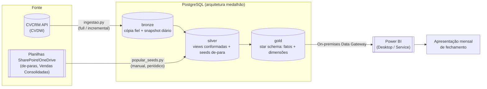

# Arquitetura da Pafil Data Platform

Este documento traz a visão consolidada de ponta a ponta do projeto: de onde o dado
vem, como ele é transformado, onde ele mora e como o Power BI consome tudo isso. Ele
complementa outros três documentos: `CONTEXTO.md` explica o porquê de negócio por
trás das decisões, `MODELO_SEMANTICO.md` detalha o desenho do star schema, e
`SKILL.md` reúne as decisões já fechadas do projeto.

## 1. Visão de ponta a ponta



Em resumo: os dados do CRM chegam pela API do CVDW e caem na camada bronze, sem
tratamento. As planilhas mantidas manualmente pelo backoffice (de-paras, Vendas
Consolidadas) entram direto na silver, que também aplica a limpeza e a padronização
sobre a bronze. A gold organiza tudo em um star schema pronto para consumo, e o Power
BI lê a gold para montar a apresentação mensal de fechamento.

## 2. Topologia de infraestrutura

Hoje o projeto roda em ambiente de desenvolvimento, na máquina do analista. O
objetivo é chegar a um ambiente de produção estável, sempre ativo. A tabela abaixo
compara os dois cenários:

| Componente | Hoje (desenvolvimento) | Alvo (produção) |
|---|---|---|
| Postgres | Instância "user space" na porta 5433, guardada em `%LOCALAPPDATA%\pafil_pg`. Não exige permissão de administrador, mas é volátil: cai a cada logoff. | Instância AWS EC2 da empresa, na região `sa-east-1`, sempre ativa. A porta do Postgres nunca fica exposta à internet. |
| Ingestão bronze (`ingestao.py`) | Rodada manualmente, na máquina do analista. | Um systemd timer instalado na própria EC2 (`infra/systemd/`), disparado todo dia às 03:00 no horário de Brasília. A conexão é feita em `localhost`, então nenhum segredo `PG_*` precisa existir fora da instância. |
| Seeds de-para (`popular_seeds.py`) | Rodada manualmente, lendo planilhas do OneDrive sincronizadas localmente. | Continua manual, rodada da máquina do analista (veja a seção 4 abaixo: essa é uma fronteira real do projeto, não uma dívida técnica a resolver). |
| Power BI | Conecta direto no Postgres local (`localhost:5433`). | O Desktop conecta por um túnel (SSM ou SSH). Para a atualização agendada do Power BI Service funcionar, também é preciso um On-premises Data Gateway rodando em um host Windows (veja a observação logo abaixo). |
| Credenciais | Ficam no `.env` local, fora do controle de versão. | `.env` local para o desenvolvimento, mais `/etc/pafil/pafil.env` (com permissão 0640) na EC2. |

Duas armadilhas do desenho anterior foram identificadas em 12 de agosto de 2026, ao
preparar a Fase 7 do roadmap, e vale registrar por que a solução mudou:

1. **O GitHub Actions não consegue alcançar um banco que não está exposto.** O
   workflow `ingestao-diaria.yml` original supunha um `PG_HOST` público, acessado com
   `sslmode=require`, o que contradiz diretamente a regra de nunca liberar a porta
   5432 para a internet. O motivo é técnico: um runner hospedado pelo GitHub tem IP
   dinâmico, dentro de uma faixa pública enorme, então "liberar só o runner" na
   prática significa liberar meio mundo. Por isso a ingestão diária passou a rodar
   dentro da própria EC2, por um systemd timer, e o workflow do GitHub Actions
   permanece apenas como um disparo manual de emergência.
2. **O On-premises Data Gateway só roda em Windows.** Ele não pode morar em uma EC2
   Linux. As opções são instalar o gateway em um host Windows sempre ativo que
   consiga alcançar a instância pela rede privada, ou aceitar que a atualização
   agendada do Power BI Service fique adiada por enquanto (o Power BI Desktop
   continua funcionando normalmente, conectando pelo túnel). Essa decisão ainda
   depende da TI: veja a seção 4c de `infra/PEDIDO_TI.md`.

## 3. Provisionamento e proteção da instância EC2

O runbook executável, com os comandos prontos para rodar, mora em
[`infra/`](infra/README.md). Esta seção é apenas o resumo das decisões tomadas. A
instância ainda não foi provisionada (é a decisão em aberto número 1 do
`ROADMAP.md`); o pedido formal para levar à reunião com a TI é
[`infra/PEDIDO_TI.md`](infra/PEDIDO_TI.md).

**O que está sendo pedido:** uma instância EC2 na região `sa-east-1` (São Paulo), com
2 vCPUs e 4 GB de RAM, disco de 50 GB do tipo `gp3`, sempre ativa, rodando Ubuntu
22.04 ou 24.04 LTS, ou então Amazon Linux 2023 (a escolha do sistema operacional fica
a critério da TI, e o script `infra/provisionar_postgres.sh` já cobre os dois
casos). A instância precisa ser dedicada a este banco, seguindo o padrão de tags de
custo da empresa, e nunca deve ser a mesma VPS pessoal usada para outros workflows
(como automações de n8n). Essa separação é uma decisão já fechada, registrada em
`SKILL.md` seção 2, motivada pela LGPD: o banco guarda dados pessoais de clientes e
leads.

**Decisões de segurança adotadas:**

1. A porta 5432 nunca entra no Security Group da instância. O acesso do analista
   acontece por um túnel (redirecionamento de porta via SSM ou SSH). O acesso do
   Power BI, quando houver gateway, é liberado por referência ao Security Group de
   origem, nunca por IP público.
2. O acesso administrativo é feito pelo SSM Session Manager, um recurso da AWS que
   dispensa a porta 22 aberta, autentica pelo IAM (o sistema de permissões da AWS) e
   registra tudo no CloudTrail (o log de auditoria da AWS). Uma alternativa aceitável,
   caso a TI prefira, é SSH por chave combinado com uma lista de IPs liberados e a
   opção `PasswordAuthentication no`.
3. Patches de segurança são aplicados automaticamente, via `unattended-upgrades` no
   Ubuntu ou `dnf-automatic` no Amazon Linux.
4. A versão instalada é o PostgreSQL 16, a mesma major version usada no ambiente
   local. Isso evita divergências sutis de dialeto SQL entre desenvolvimento e
   produção, o tipo de bug que costuma aparecer só depois que o sistema já está no ar.
5. As senhas são geradas na própria instância (com `openssl rand`) e gravadas em um
   arquivo com permissão 0600, legível só pelo usuário root. Elas nunca aparecem como
   argumento de comando, no histórico do shell ou no repositório.
6. Existem duas roles (papéis de acesso) no banco: `pafil_app`, dona do banco e
   responsável pela ingestão e pelo DDL, e `pafil_bi`, que tem acesso somente leitura
   às camadas silver e gold. A camada bronze fica de fora do acesso de `pafil_bi`
   porque é ali que os dados pessoais ainda estão em estado bruto, sem nenhum
   tratamento.
7. O backup roda em duas frentes: um `pg_dump` diário, às 02:30, com retenção de 7
   dias (e envio opcional para o S3), além do snapshot do disco EBS. O `pg_dump`
   protege contra erro lógico (por exemplo, alguém apagar dados por engano), algo que
   um snapshot de disco sozinho não resolve. Esse backup é indispensável porque, embora
   a camada bronze seja inteiramente reconstruível a partir da API com o comando
   `--full`, os seeds de-para não são: eles vêm de planilhas mantidas à mão, e não
   existe outro lugar de onde recuperá-los.

**Para aplicar o schema e migrar os dados**, os mesmos scripts já usados em
desenvolvimento são reaproveitados. Basta reapontar o `.env` para a nova instância e
rodar, nesta ordem:

```bash
python criar_database.py                       # cria o banco, se necessário
python ingestao.py --full --criar-tabelas       # aplica bronze.sql + faz a carga completa real
python aplicar_tudo.py                          # roda silver -> gold -> seeds
python conferir_carga.py                        # valida a origem (API) contra a bronze carregada
```

> A carga completa deve ser feita dentro da própria instância, dentro de uma sessão
> `tmux` (para sobreviver a uma queda de conexão). São cerca de 777 mil registros
> contra uma API limitada a aproximadamente 18 requisições por minuto, o que significa
> um processo de várias horas. Não faz sentido depender do notebook do analista
> continuar ligado e conectado durante todo esse tempo.

## 4. Uma fronteira arquitetural: os de-paras continuam manuais

Os carregadores de de-para (as opções `--gerentes`, `--headcount-corretores`,
`--leads-apoio`, `--etapa-precadastro`, `--credito-manual` e `--xlsm` do
`popular_seeds.py`) leem planilhas do SharePoint e OneDrive da empresa, através de um
caminho de arquivo local (as variáveis `DEPARA_*_XLSX` e `*_XLSM` do `.env`). Isso só
funciona em uma máquina com o OneDrive sincronizado, e uma instância EC2 rodando
Linux não tem esse contexto.

**A decisão adotada foi dividir o problema em duas partes.** A ingestão diária da
bronze roda de forma totalmente automatizada, por um systemd timer na EC2, sem
depender da máquina de nenhuma pessoa específica. Já a atualização dos de-paras
(usados pela silver, na forma de seeds) continua sendo um passo manual e periódico,
rodado da máquina do analista responsável, que aponta o `PG_*` do `.env` para o
Postgres da EC2 através de um túnel (SSM ou SSH), sem nunca abrir a porta do banco
publicamente.

Vale deixar claro que isso não é uma dívida técnica a ser "resolvida" algum dia: é
uma fronteira real, que existe enquanto as planilhas de origem (Vendas Consolidadas,
headcount, de-para de gerentes, entre outras) continuarem sendo mantidas manualmente
pelo backoffice. Se, no futuro, essas planilhas migrarem para um sistema que ofereça
uma API ou exportação automatizável, essa fronteira pode deixar de existir.

## 5. Onde cada segredo mora

A política completa de segurança e LGPD está na seção 7 de `SKILL.md`. Aqui vai um
resumo de onde cada credencial fica guardada:

| Segredo | Onde mora | Nunca deve ir para |
|---|---|---|
| `CVCRM_TOKEN` e `CVCRM_EMAIL` | `.env` local, em desenvolvimento, e `/etc/pafil/pafil.env` (permissão 0640) na EC2 | O repositório, os logs, ou qualquer mensagem |
| `PG_PASSWORD` (produção) | Gerada na própria EC2, salva primeiro em `/root/pafil_credenciais.txt` (permissão 0600), depois copiada para `/etc/pafil/pafil.env` e para o `.env` local do analista | O repositório, os secrets do GitHub |
| `PG_PASSWORD` (desenvolvimento local) | Só no `.env` local. É a senha de uma instância descartável, sem exposição de rede | Não se aplica: o risco de exposição dessa senha específica é aceito, veja a observação abaixo |
| Caminhos de planilha (as variáveis `DEPARA_*`) | `.env` local. Não são segredo no sentido estrito, mas são específicos de cada máquina | O `.env.example`, que usa um placeholder no lugar do caminho real |

> **Observação sobre a senha local de desenvolvimento.** A senha do Postgres local
> (`PafilLocalDev2026`) aparece documentada, de propósito, em `CONSULTAR.md` e em
> `powerbi/README.md`. Isso é intencional: essa instância é descartável, não exige
> permissão de administrador, não fica exposta fora de `localhost`, e pode ser
> recriada do zero a qualquer momento (veja a memória do projeto sobre o Postgres
> local em user space). Ainda assim, documentar essa senha só é aceitável porque o
> repositório é privado. Se a visibilidade do repositório mudar no futuro, essa senha
> precisa ser trocada, e os documentos que a citam precisam ser atualizados.
