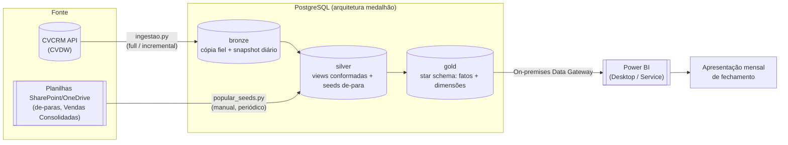

# Arquitetura da Pafil Data Platform

Este documento traz a visão consolidada de ponta a ponta do projeto: de onde o dado
vem, como ele é transformado, onde ele mora e como o Power BI consome tudo isso. Ele
complementa outros três documentos: `CONTEXTO.md` explica o porquê de negócio por
trás das decisões, `MODELO_SEMANTICO.md` detalha o desenho do star schema, e
`SKILL.md` reúne as decisões já fechadas do projeto.

## 1. Visão de ponta a ponta



Em resumo: os dados do CRM chegam pela API do CVDW e caem na camada bronze, sem
tratamento. As planilhas mantidas manualmente pelo backoffice (de-paras, Vendas
Consolidadas) entram direto na silver, que também aplica a limpeza e a padronização
sobre a bronze. A gold organiza tudo em um star schema pronto para consumo, e o Power
BI lê a gold para montar a apresentação mensal de fechamento.

## 2. Topologia de infraestrutura

Hoje o projeto roda em dois ambientes: desenvolvimento, na máquina do analista, e
produção, numa máquina Windows 10 Pro física/local da empresa, de pé desde 20 de
agosto de 2026. A tabela abaixo compara os dois cenários. **Atenção:** o plano
original (e uma versão anterior desta tabela) previa produção numa instância AWS
EC2; a TI nunca a provisionou, e passou credenciais de RDP para a máquina Windows em
vez disso (não é uma instância AWS — o teste do endereço de metadados da AWS deu
timeout nela). O runbook real é `infra/RUNBOOK_WINDOWS.md`; `infra/README.md` e
`infra/PEDIDO_TI.md` continuam no repositório como histórico da linha do tempo EC2.

| Componente | Hoje (desenvolvimento) | Produção (máquina Windows real) |
|---|---|---|
| Postgres | Instância "user space" na porta 5433, guardada em `%LOCALAPPDATA%\pafil_pg`. Não exige permissão de administrador, mas é volátil: cai a cada logoff. | Postgres 16 instalado como Serviço do Windows (`Startup Type = Automatic`), porta 5432, `pg_hba.conf` restrito a `127.0.0.1`/`::1`. Sobrevive a logoff e a desconexão de RDP; só para com um `Stop-Service` explícito ou a máquina desligando. |
| Ingestão bronze (`ingestao.py`) | Rodada manualmente, na máquina do analista. | Uma Tarefa Agendada do Windows (`PafilDW - Ingestao diaria`), rodando como conta `SYSTEM`, de hora em hora das 06h às 18h (não um disparo único de madrugada como o desenho original de EC2 previa). A conexão é feita em `localhost`, então nenhum segredo `PG_*` precisa existir fora da máquina. |
| Seeds de-para (`popular_seeds.py`) | Rodada manualmente, lendo planilhas do OneDrive sincronizadas localmente. | Continua manual, rodada da máquina do analista através de um túnel SSH até a VM (veja a seção 4 abaixo: essa é uma fronteira real do projeto, não uma dívida técnica a resolver — embora um plano em andamento, via Microsoft Graph API, deva eliminar boa parte dessa dependência). |
| Power BI | Conecta direto no Postgres local (`localhost:5433`). | O On-premises Data Gateway está instalado na própria máquina Windows, conectando em `localhost`, o que já destrava a atualização agendada do Power BI Service (não é mais uma decisão em aberto, como o desenho de EC2 previa). |
| Credenciais | Ficam no `.env` local, fora do controle de versão. | `.env` local para o desenvolvimento; em produção, as credenciais do banco ficam em `C:\pafil\pafil_credenciais.txt` (ACL restrita ao grupo Administrators), e o `.env` da VM não é editado diretamente para apontar aos bancos remotos — variáveis de ambiente são setadas por sessão de PowerShell quando necessário (ver `infra/RUNBOOK_WINDOWS.md`, seção 4). |

Duas armadilhas do desenho anterior (pensado para EC2) foram identificadas em 12 de
agosto de 2026, ao preparar a Fase 7 do roadmap, e vale registrar por que a solução
mudou, mesmo que o destino final tenha sido outro:

1. **O GitHub Actions não consegue alcançar um banco que não está exposto.** O
   workflow `ingestao-diaria.yml` original supunha um `PG_HOST` público, acessado com
   `sslmode=require`, o que contradiz diretamente a regra de nunca liberar a porta
   5432 para a internet. O motivo é técnico: um runner hospedado pelo GitHub tem IP
   dinâmico, dentro de uma faixa pública enorme, então "liberar só o runner" na
   prática significa liberar meio mundo. Por isso a ingestão diária passou a rodar
   dentro da própria máquina de produção, por uma Tarefa Agendada do Windows, e o
   workflow do GitHub Actions permanece apenas como um disparo manual de emergência.
2. **O On-premises Data Gateway só roda em Windows.** Isso deixou de ser um
   problema: como a máquina de produção real já é Windows (ao contrário do plano de
   EC2 Linux original), o gateway simplesmente foi instalado nela, sem precisar de
   nenhuma decisão adicional da TI sobre onde ele mora.

## 3. Provisionamento e proteção da máquina de produção

O runbook executável, com os comandos prontos para rodar, mora em
[`infra/RUNBOOK_WINDOWS.md`](infra/RUNBOOK_WINDOWS.md). Esta seção é apenas o resumo
das decisões tomadas. `infra/README.md` e `infra/PEDIDO_TI.md` descrevem o plano
original de uma instância AWS EC2, nunca provisionada; ficam no repositório como
histórico dessa linha do tempo, não como o estado real.

**O que existe de fato:** uma máquina Windows 10 Pro física ou local da empresa,
acessada por RDP, com um Intel Core i5-2400 (CPU de desktop de 2011) e dois discos
SSD. Não há Security Group, VPC, EBS ou snapshot automático por trás dela — é uma
estação de trabalho, não um servidor gerenciado pela AWS. Isso muda o que protege a
máquina (o Firewall do Windows, não um Security Group) e o que garante que o banco
sobrevive sem ninguém logado (um Serviço do Windows e Tarefas Agendadas rodando como
`SYSTEM`, não um `systemd timer`).

**Decisões de segurança adotadas:**

1. A porta 5432 nunca é liberada no Firewall do Windows para fora da máquina, exceto
   se o gateway do Power BI algum dia precisar morar em outra máquina (não é o caso
   hoje: o gateway está na própria máquina de produção). O acesso do analista
   acontece por um túnel SSH (o OpenSSH Server do Windows, habilitado nesta máquina),
   com a porta 22 liberada só para o IP do notebook do analista.
2. O acesso administrativo é feito por RDP, com a ressalva de que o Windows 10 Pro
   (diferente do Server) só permite uma sessão remota por vez: se outra pessoa logar
   na máquina, a sessão do analista é desconectada (sem derrubar o Postgres ou as
   tarefas agendadas, que são serviços do sistema).
3. Patches de segurança seguem o ciclo normal de atualização do Windows da máquina,
   não um mecanismo automatizado próprio do projeto (diferente do
   `unattended-upgrades`/`dnf-automatic` do plano de EC2 original).
4. A versão instalada é o PostgreSQL 16, a mesma major version usada no ambiente
   local. Isso evita divergências sutis de dialeto SQL entre desenvolvimento e
   produção, o tipo de bug que costuma aparecer só depois que o sistema já está no ar.
5. As senhas são geradas na própria máquina e gravadas em
   `C:\pafil\pafil_credenciais.txt`, com ACL restrita ao grupo Administrators via
   `icacls`. Elas nunca aparecem como argumento de comando, no histórico do shell ou
   no repositório.
6. Existem duas roles (papéis de acesso) no banco: `pafil_app`, dona do banco e
   responsável pela ingestão e pelo DDL, e `pafil_bi`, que tem acesso somente leitura
   às camadas silver e gold. A camada bronze fica de fora do acesso de `pafil_bi`
   porque é ali que os dados pessoais ainda estão em estado bruto, sem nenhum
   tratamento.
7. O backup roda uma vez por dia, às 05:00, via `infra/backup_pg.ps1`. Sem EBS por
   trás desta máquina, o `pg_dump` deixou de ser uma segunda camada de proteção e
   passou a ser a única rede de segurança contra perda de disco: o script precisa
   copiar o dump para fora da máquina (uma pasta OneDrive/SharePoint já sincronizada,
   ou um bucket S3 configurado à parte), ou não é, na prática, um backup confiável.
   Esse backup é indispensável porque, embora a camada bronze seja inteiramente
   reconstruível a partir da API com o comando `--full`, os seeds de-para não são:
   eles vêm de planilhas mantidas à mão, e não existe outro lugar de onde
   recuperá-los.

**Para aplicar o schema e migrar os dados**, os mesmos scripts já usados em
desenvolvimento são reaproveitados, rodando dentro da própria máquina (não do
notebook do analista, para não depender dele continuar ligado durante as várias
horas que a carga completa leva):

```powershell
.\.venv\Scripts\python criar_database.py                  # cria o banco, se necessário
.\.venv\Scripts\python ingestao.py --full --criar-tabelas  # aplica bronze.sql + faz a carga completa real
.\.venv\Scripts\python aplicar_tudo.py                     # roda silver -> gold -> seeds
.\.venv\Scripts\python conferir_carga.py                   # valida a origem (API) contra a bronze carregada
```

> A carga completa demora horas, já que a API é limitada a cerca de 18 requisições
> por minuto e há aproximadamente 777 mil registros. Como uma sessão de RDP
> desconectada (não deslogada) mantém os processos vivos, o jeito mais simples é
> rodar direto e só desconectar sem deslogar — ou, para não depender de lembrar
> disso, usar uma Tarefa Agendada de disparo único rodando como `SYSTEM` (ver
> `infra/RUNBOOK_WINDOWS.md`, seção 3).

## 4. Uma fronteira arquitetural: os de-paras continuam manuais

Os carregadores de de-para (as opções `--gerentes`, `--headcount-corretores`,
`--leads-apoio`, `--etapa-precadastro`, `--credito-manual` e `--xlsm` do
`popular_seeds.py`) leem planilhas do SharePoint e OneDrive da empresa, através de um
caminho de arquivo local (as variáveis `DEPARA_*_XLSX` e `*_XLSM` do `.env`). Isso só
funciona em uma máquina com o OneDrive sincronizado, e a máquina Windows de produção
não tem esse contexto (uma tentativa de sincronizar o OneDrive diretamente na VM, em
31/ago/2026, falhou — ver `infra/RUNBOOK_WINDOWS.md`, seção 4).

**A decisão adotada foi dividir o problema em duas partes.** A ingestão diária da
bronze roda de forma totalmente automatizada, por uma Tarefa Agendada do Windows na
própria máquina de produção, sem depender da máquina de nenhuma pessoa específica.
Já a atualização dos de-paras (usados pela silver, na forma de seeds) continua sendo
um passo manual e periódico, rodado da máquina do analista responsável, que aponta o
`PG_*` para o Postgres de produção através de um túnel SSH, sem nunca abrir a porta
do banco publicamente.

Vale deixar claro que isso não é uma dívida técnica a ser "resolvida" algum dia: é
uma fronteira real, que existe enquanto as planilhas de origem (Vendas Consolidadas,
headcount, de-para de gerentes, entre outras) continuarem sendo mantidas manualmente
pelo backoffice. Se, no futuro, essas planilhas migrarem para um sistema que ofereça
uma API ou exportação automatizável, essa fronteira pode deixar de existir.

**Atualização de setembro de 2026:** essa migração está em andamento. Um plano em
execução (dbt-core + Airflow, ver `SKILL.md`) inclui trocar a leitura de arquivo
local por uma busca direto no SharePoint via Microsoft Graph API, eliminando a
dependência do túnel SSH e do OneDrive sincronizado para a maior parte das
planilhas. A exceção são os poucos processos que dependem de Excel COM (edição do
headcount com pivot table, o fechamento mensal escrevendo na Vendas Consolidadas):
esses continuam manuais mesmo depois dessa migração, porque não são uma leitura de
arquivo, e sim uma automação do próprio Excel, que não é confiável rodando sem
sessão interativa.

## 5. Onde cada segredo mora

A política completa de segurança e LGPD está na seção 7 de `SKILL.md`. Aqui vai um
resumo de onde cada credencial fica guardada:

| Segredo | Onde mora | Nunca deve ir para |
|---|---|---|
| `CVCRM_TOKEN` e `CVCRM_EMAIL` | `.env` local, em desenvolvimento, e `.env` da máquina de produção (não editado por padrão em cada atualização, ver `infra/RUNBOOK_WINDOWS.md` seção 4) | O repositório, os logs, ou qualquer mensagem |
| `PG_PASSWORD` (produção) | Gerada na própria máquina Windows, salva em `C:\pafil\pafil_credenciais.txt` (ACL restrita ao grupo Administrators via `icacls`). Para o túnel do analista, é passada como variável de ambiente de sessão (`$env:PG_PASSWORD`), não gravada no `.env` local | O repositório, os secrets do GitHub |
| `PG_PASSWORD` (desenvolvimento local) | Só no `.env` local. É a senha de uma instância descartável, sem exposição de rede | Não se aplica: o risco de exposição dessa senha específica é aceito, veja a observação abaixo |
| Caminhos de planilha (as variáveis `DEPARA_*`) | `.env` local. Não são segredo no sentido estrito, mas são específicos de cada máquina | O `.env.example`, que usa um placeholder no lugar do caminho real |

> **Observação sobre a senha local de desenvolvimento.** A senha do Postgres local
> (`PafilLocalDev2026`) aparece documentada, de propósito, em `CONSULTAR.md` e em
> `powerbi/README.md`. Isso é intencional: essa instância é descartável, não exige
> permissão de administrador, não fica exposta fora de `localhost`, e pode ser
> recriada do zero a qualquer momento (veja a memória do projeto sobre o Postgres
> local em user space). Ainda assim, documentar essa senha só é aceitável porque o
> repositório é privado. Se a visibilidade do repositório mudar no futuro, essa senha
> precisa ser trocada, e os documentos que a citam precisam ser atualizados.
